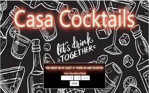

# PROJECT 1: CASA COCKTAIL

## INTRODUCTION
Last minute guests coming over or simply forgot to make a run to the liquor store?
Casa Cocktail will have users whipping out drinks like a seasoned bartender. Simply pick the alcohol(s) and mixer(s) on hand and the website will give generate a list of cocktails. From the user's selection of drink, a detailed recipe will not only give the ingredients, but will go step by step on how to make the drink and picture of how it should look. As an extra feature, a randomly generated joke (fact) will be generated to help break the ice with the user's guests.

                    *** User must be 21 to enter site ***
 

## FEATURES
1. The user will choose the ingredients that are readily available in the home bar.

    * Click the alcohol or mixer bottle to see a list of ingredients to choose from.

2. Once the ingredients are chosen the user can submit choices.
    * The user can choose between various alcohols and mixers.
3. A page is made available for the user to choose which cocktail recipe they can make based on their choices.

4. Once a cocktail is chosen, the user can view the recipe and also see a randomly generated joke.
    * A page with the recipe, picture of the cocktail, and a joke.

 

## PREVIEW

1. **Opening Page**

 

2. **Beverage Choice Page**

 

3. **Drink Menu**

4. **Recipe Page**

 

## CONTRIBUTORS

Eric Garcia

Rima Odolski

George Sun

Leandra Turner

 

### RESOURCES

* Opening Cocktail Background created by:

     www.freepik.com

* Wooden Background created by:

  ***YingYang***

* Random Joke API:  

    *JokeApi* :**Author Sven Fehler**

* Drink/Recipe API: 

    ***TheCocktailDB***

* Badges for Markdown: 

    ***Naereen Badges:*** https://github.com/Naereen/badges
     

* Sorry Image created by: 
   
   *Red Fang* via Giphy
### BADGES

Click the badge below to go directly to website

